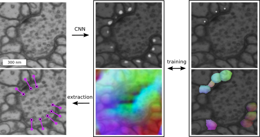

Synful
======
Overview
--------
Synful: A project for the automated detection of synaptic partners in Electron Microscopy brain data using U-Nets (type of Convolutional Neural Network).

This repository provides train and predict scripts for synaptic partner detection. For more details, see our [bioRxiv preprint](https://www.biorxiv.org/content/10.1101/2019.12.12.874172v1).

We used the method to predict 244 Million synaptic partners in the full adult fly brain (FAFB) dataset.
Please see https://github.com/funkelab/synful_fafb for data dissemination and benchmark datasets.

Please don't hesitate to open
an issue or write us an email ([Julia
Buhmann](mailto:buhmannj@janelia.hhmi.org) or [Jan
Funke](mailto:funkej@janelia.hhmi.org)) if you have any questions!

- [ ] Add train scripts
- [ ] Add inference scripts
- [ ] Add download links for pretrained models

Method
------
The pipeline processes 3D raw data in two steps into synaptic partners:
  1) inference of a) `syn_indicator_mask` (postsynaptic locations) and b) `direction_vector` (vector pointing from postsynaptic location to its presynaptic partner)
  2) synapse extraction: a) locations extractions based on `syn_indicator_mask` and b) finding presynaptic partner based on `direction_vector`




Installation
------------
from source (creating a conda env is optional, but recommended).
- Clone this repository.
- In a terminal:

```bash
conda create -n <conda_env_name> python=3.6
source activate <conda_env_name>
cd synful
pip install -r requirements.txt
python setup.py install
```

Training
--------

Train scripts will be added soon.


Inference
--------

Inference scripts will be added soon.
